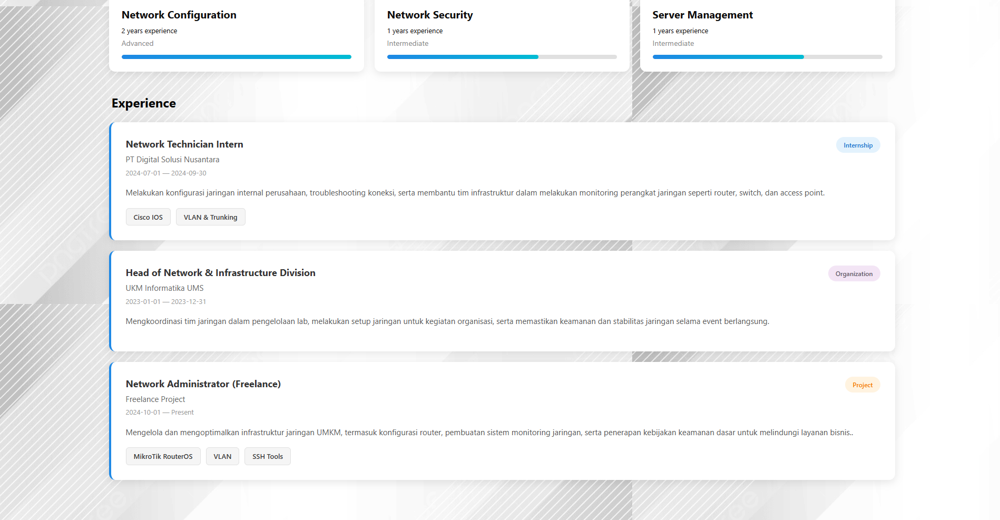

# Diskripsi Aplikasi
Aplikasi ini merupakan Portfolio Web Pribadi yang menampilkan informasi lengkap mengenai profil, keahlian, dan pengalaman saya di bidang jaringan komputer.
Website ini dibangun menggunakan React dengan styling berbasis CSS kustom, menampilkan UI yang bersih, modern, dan responsif.

Fitur utama aplikasi:
* Halaman Profile berisi data diri, headline, dan foto profil.
* Halaman Skills & Expertise berisi keahlian terkait jaringan komputer.
* Halaman Experience berisi riwayat pengalaman (internship & freelance) di bidang jaringan.
* Tampilan minimalis dengan layout yang rapi dan terpusat.

# Cara Menjalankan 
1. Masuk Ke Terminal VSCode, masuk ke Git Bash, lalu Clone repositori :
   git clone "https://github.com/tif1336/single-page-application-reactjs-untuk-cv-mahasiswa-zulfatn"
2. Masuk ke Folder Projek :
   "cd ProjekPorto"
3. Install dependencies :
   "npm install"
4. Jalankan aplikasi dalam mode development :
   "npm run dev"
5. Akan Muncul linknya, lalu salin dan buka di browser :
   "http://localhost:5173/"

# Link deployment 
"https://cv-mahasiswa-zulfatn-pemweb-framewo-pi.vercel.app/"

# Screenshot Tampilan 

